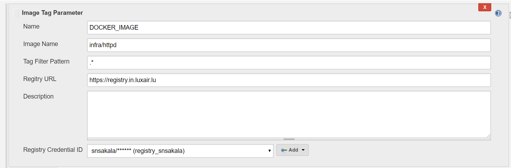
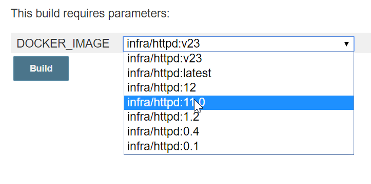

# how to build the Jenkins Plugin
 
## Install skdman
```
sudo apt install zip
curl -s "https://get.sdkman.io" | bash
source .sdkman/bin/sdkman-init.sh 
```

## install JDK and Maven
```
sdk install java 8.0.232-open
javac -version
sdk install maven
mvn -version
```

## install fontconfig on ubuntu
```
sudo apt install -y fontconfig
```
Error without fontconfig
```
Caused by: java.lang.NullPointerException
        at sun.awt.FontConfiguration.getVersion(FontConfiguration.java:1264)
        at sun.awt.FontConfiguration.readFontConfigFile(FontConfiguration.java:219)
```

## test, build and package
```
mvn verify
mvn hpi:run
mvn package
```
Plugin **./target/Image_Tag_Parameter.hpi** can be installed on any jenkins instance

## access the dev environment
Point the url to http://localhost:8080/jenkins

## Screenshots


